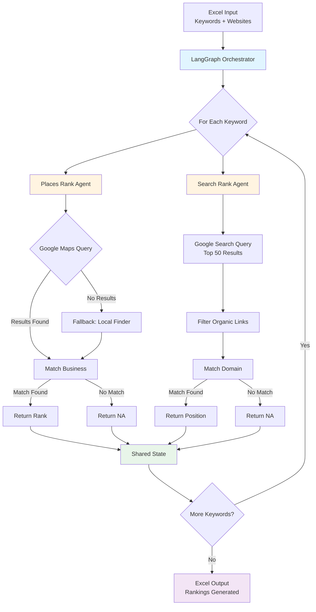

# Agentic SEO Ranking System

An **Agentic AI-based SEO Ranking System** that accurately determines **Google Places (Local)** and **Google Organic Search** rankings for multiple keywords using **SerpAPI** and **LangGraph**.

<p align="center">
  <a href="https://www.python.org/"></a>
  <a href="https://groq.com/"></a>
  <a href="https://www.langchain.com/"></a>
  <a href="https://github.com/langchain-ai/langgraph"></a>
  <a href="https://www.gradio.app/"></a>
  <a href="https://python-dotenv.readthedocs.io/"></a>
  
  
</p>

The system dynamically adapts to Google's ranking behavior by selecting the correct Google surface (Maps, Local Finder, or Search), making it more reliable than traditional static scripts.

---

## 🚀 Features

- ✅ Google Places (Local) ranking detection  
- ✅ Google Organic Search ranking (Top 50 results)  
- ✅ Hybrid Places logic (Google Maps → Local Finder fallback)  
- ✅ Agentic architecture using LangGraph  
- ✅ Excel-based input and output  
- ✅ Deterministic, production-ready workflow  

---

## 🧠 Why Agentic?

Google ranking behavior varies based on **keyword intent**:
- Brand keywords behave differently from category keywords
- Google Maps does not return results for all searches
- Local Finder and Maps are separate systems

This project solves the problem using an **agentic execution model**, where each agent has a single responsibility and execution is controlled through LangGraph.

---

## 🤖 How This Is Agentic: Deep Dive

### Traditional Script vs Agentic Approach

**Traditional Script (Non-Agentic)**
```
1. Call Google Maps API
2. Parse response
3. Return result
4. Done
```
❌ **Problem**: Fails when Google Maps returns no results for certain keyword types

**Agentic Approach (This Project)**
```
1. Places Rank Agent decides strategy
2. Tries Google Maps
3. Agent evaluates result
4. If needed, agent switches to Local Finder
5. Agent matches and validates business
6. Returns confident result
```
✅ **Solution**: Agent adapts strategy based on results

---

### What Makes This System "Agentic"?

#### 1. **Autonomous Decision Making**
Agents don't follow a rigid script. They make decisions based on:
- Whether Google Maps returned results
- Whether a business match was found
- Which ranking surface to query next

**Example**:
```python
# Agentic Logic
if maps_results_empty:
    agent_decides_to_try_local_finder()
else:
    agent_processes_maps_results()
```

This is **not hardcoded branching**—the agent evaluates state and chooses the next action.

---

#### 2. **Single Responsibility Agents**
Each agent has **one clear job**:

| Agent | Responsibility | Independence |
|-------|---------------|--------------|
| **Places Rank Agent** | Determine Google Places rank using adaptive strategy | Can operate standalone |
| **Search Rank Agent** | Determine Google Search rank from organic results | Can operate standalone |

Agents don't interfere with each other. They work in parallel, and their results are merged in shared state.

---

#### 3. **State Management Through LangGraph**
LangGraph acts as the **orchestration layer**:
- Maintains **shared state** (current keyword, website, rankings)
- Routes execution flow between agents
- Ensures agents don't overwrite each other's results
- Allows conditional execution (e.g., retry logic)

**State Flow**:
```
Initial State: {keyword: "pizza", website: "example.com"}
↓
Places Agent adds: {google_rank: 3}
↓
Search Agent adds: {google_rank_1: 7}
↓
Final State: {keyword: "pizza", website: "example.com", google_rank: 3, google_rank_1: 7}
```

---

#### 4. **Fallback & Adaptive Strategies**
The system doesn't fail—it **adapts**:

**Scenario 1**: Brand keyword (e.g., "Starbucks near me")
- Google Maps returns results ✅
- Agent uses Maps data directly

**Scenario 2**: Generic keyword (e.g., "coffee shop")
- Google Maps returns empty []
- Agent **automatically switches** to Local Finder
- Finds results and ranks business

**Scenario 3**: Business not in top results
- Agent searches through all results
- Returns `NA` if not found (honest failure)

This **dynamic adaptation** is core to agentic behavior.

---

#### 5. **Tool Use & External APIs**
Agents interact with external tools (SerpAPI) and make intelligent API calls:
- **Google Maps API** (`engine=google_maps`)
- **Local Finder API** (`engine=google`, `tbm=lcl`)
- **Google Search API** (`engine=google`)

The agent **chooses which tool to use** based on context, not a fixed sequence.

---

#### 6. **Deterministic Yet Flexible**
Unlike traditional AI agents that might hallucinate, this system is:
- **Deterministic**: Same input → Same output
- **Flexible**: Adapts strategy based on API responses
- **Reliable**: Always returns a result (rank or `NA`)

This balance makes it **production-ready** while maintaining agentic intelligence.

---

### Why Not Just Use If-Else Statements?

**You could write this with if-else**, but here's why the agentic approach is superior:

| Aspect | If-Else Script | Agentic System |
|--------|---------------|----------------|
| **Scalability** | Hard to add new ranking sources | Easy to add new agents |
| **Maintainability** | Spaghetti code as logic grows | Modular, each agent is independent |
| **State Management** | Manual variable tracking | LangGraph handles state |
| **Debugging** | Hard to trace execution path | Clear agent → action → result flow |
| **Testing** | Test entire script | Test agents individually |
| **Future AI Integration** | Would require full rewrite | Can add LLM-based reasoning agents |

---

### Future Agentic Enhancements

This foundation enables powerful future features:

1. **Intent Detection Agent**
   - Uses LLM to classify keyword intent
   - Routes to specialized ranking agents

2. **Confidence Scoring Agent**
   - Evaluates ranking reliability
   - Flags uncertain results for review

3. **Explanation Agent**
   - Generates human-readable ranking insights
   - "Your business ranks #3 because competitors have more reviews"

4. **Recommendation Agent**
   - Suggests SEO improvements
   - "Add business hours to improve Places ranking"

5. **Multi-Agent Collaboration**
   - Agents negotiate which one should handle edge cases
   - Voting system for ambiguous matches

---

### Key Takeaway

This project is **agentic** because:
- ✅ Agents make autonomous decisions
- ✅ Each agent has clear responsibility
- ✅ State is managed centrally (LangGraph)
- ✅ System adapts to external conditions
- ✅ Architecture supports future AI enhancements

It's not just "AI-powered"—it's **agent-based**, which means the system thinks, adapts, and evolves rather than blindly executing steps.

---

## 🏗️ System Architecture

### Agents Used
- **Places Rank Agent**
  - Determines Google Places ranking
  - Uses hybrid logic (Maps → Local Finder)
- **Search Rank Agent**
  - Determines Google Search ranking (organic links only)

### Orchestration
- **LangGraph** manages execution order and shared state
- Each keyword is processed as an independent agentic flow

### Architecture Diagram



---

## 🔍 Google Places Ranking Logic

1. Query **Google Maps** (`engine=google_maps`)
2. If no results are returned:
   - Fallback to **Google Local Finder** (`engine=google`, `tbm=lcl`)
3. Match business using:
   - Business name
   - Website domain
4. Return rank or `NA` if not found

This mirrors real Google Places behavior and avoids false negatives.

---

## 🔎 Google Search Ranking Logic

- Queries Google Search using SerpAPI
- Fetches up to **top 50 organic results**
- Ignores ads and sponsored listings
- Matches target website domain
- Returns exact ranking position or `NA`

This logic remains **independent** of Google Places ranking.

---

## 📂 Input & Output

### Input (Excel)
| Column | Description |
|--------|-------------|
| sn | Serial number |
| Keyword | Search keyword |
| Website | Website URL to check ranking |

### Output (Excel)
| Column | Description |
|--------|-------------|
| google rank | Google Places rank |
| google rank-1 | Google Search rank |

---

## 🛠️ Tech Stack

- **Python**
- **LangGraph** (Agent orchestration)
- **SerpAPI** (Google data source)
- **Pandas** (Excel processing)
- **dotenv** (Environment variable management)

---

## ⚙️ Setup & Installation

### 1️⃣ Install Dependencies
```bash
pip install pandas serpapi python-dotenv langgraph
```

### 2️⃣ Configure Environment Variables

Create a `.env` file:

```env
SERPAPI_API_KEY=your_serpapi_key_here
```

---

## ▶️ How to Run

```bash
python agentic_ranking.py
```

Ensure the input Excel file is named:

```
Ranking_Website.xlsx
```

The output file will be generated as:

```
Agentic_Ranking_Website_Results.xlsx
```

---

## 📊 Key Learnings

- Google ranking is **intent-based**, not static
- A single API strategy does not work for all keywords
- Agentic orchestration improves reliability and scalability
- Hybrid logic is essential for accurate Places ranking

---

## 🚧 Limitations

- Dependent on SerpAPI rate limits
- Rankings may vary by location and time
- Google algorithm changes may affect results

---

## 🔮 Future Enhancements

- Intent Detection Agent
- Ranking explanation & reason generation
- Confidence scoring for ranks
- LLM-based SEO recommendations
- API or dashboard-based interface

---

## 📌 Conclusion

The **Agentic SEO Rank Analyzer** demonstrates how agent-based systems can handle real-world SEO complexity by dynamically adapting to platform behavior while remaining modular, scalable, and production-ready.

---

- 📧 Email: harshitwaldia112@gmail.com
- 🐦 Twitter: [@HarshitWaldia](https://x.com/HarshitWaldia)
- 💼 LinkedIn: [Harshit Waldia](https://www.linkedin.com/in/harshit-waldia/)
- ⚙️ GitHub: [@HarshitWaldia](https://github.com/HarshitWaldia)

---

## 🌟 Star History

If you find this project helpful, please consider giving it a star! ⭐

---

## 👨‍💻 Author

**Harshit Waldia**


<p align="center">
  <strong>Ahaṁ Brahmāsmi | अहं ब्रह्मास्मि</strong>
</p>

*The true self is not the body but an eternal, infinite part of the universe*
